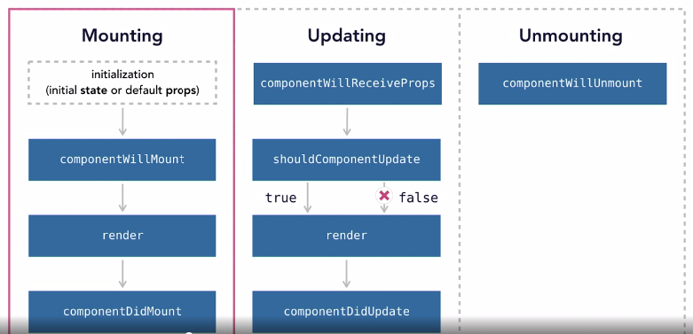

## Reference
-[React: State Management](https://www.linkedin.com/learning/react-state-management)
-[You might not need Redux]()


## React life cycle



## Context


## Hooks API (React 16.8, February 16, 2019)
```
import {useState} from 'react'
```